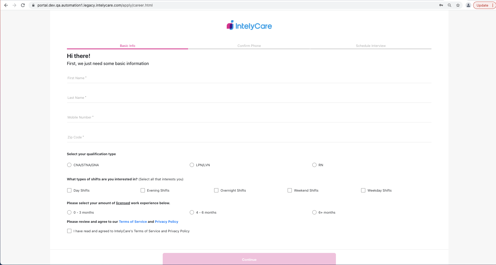

# SDET Automation Challenge

This will cover the instructions and details for the automation challenge

## Task
The task is to write an automated test validating that a user can create an account on the Intelycare application page and can proceed ahead with the next 2 steps in the application process.

1. Go to [Intelycare Careers](https://portal.dev.qa.automation1.legacy.intelycare.com/apply/career.html)
    a. Create the account using the email address. It be can any alphanumeric character with the domain name **@mailinator.com** and any password. 
    


2. On the Basic Info screen, validate below two test conditions
    a. The continue button is unclickable without mandatory fields
    b. Filling all the fields enable the Continue button
    c. Clicking on the continue button page redirects to OTP page 



**Note**: Please enter 10 digit phone number (7589577506) and 5 digit zip code (02090) for test data during testing.

## Test Framework Instructions

1. Fork this repository to your own GitHub account. You'll be submitting your final repository to us to review.
2. Add test files in /test/specs folder
3. To run your tests, execute: 
```
$ npm install
$ npx wdio run wdio.conf.js
```