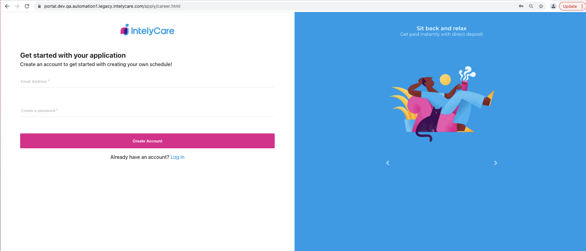

# SDET Automation Challenge

This will cover the instructions and details for the automation challenge

## Task
The task is to write an automated test validating that a user can create an account on the Intelycare application page and can proceed ahead with the next 2 steps in the application process.

1. Go to [Intelycare Careers](https://portal.dev.qa.automation1.legacy.intelycare.com/apply/career.html)
    a. Create the account using the email address. It be can any alphanumeric character with the domain name **@mailinator.com** and any password. 
    


2. On the Basic Info screen, validate below two test conditions
    a. The continue button is unclickable without mandatory fields
    b. Filling all the fields enable the Continue button
    c. Clicking on the continue button page redirects to OTP page 


**Note**: Please enter 10 digit phone number (7589577506) and 5 digit zip code (02090) for test data during testing.

## Test Framework Instructions

1. Download Sample Framework framework_template.zip
2. Add test file on /test/specs folder
3. To run your tests, execute: 
```
$ npm install
$ npx wdio run wdio.conf.js
```

**This the the end of the required details of the Coding Challenge for an SDET I and SDET II candidates. Details below are required for Senior SDET roles and optional for SDET I and SDET II**

***
### Required Details for Senior SDET
##### -----Optional for SDET I and SDET II-----

1. Page Object Model 
2. Package.json should have all the required libraries
3. Action utility file (Library) to handle user actions with fluent waits. 
4. Properties file from where basic information is read. 
5. Any Test Report 

**Good to Have in addition to the above:**
1. Parallel execution
2. Multiple spec files and test suite
3. Docker image